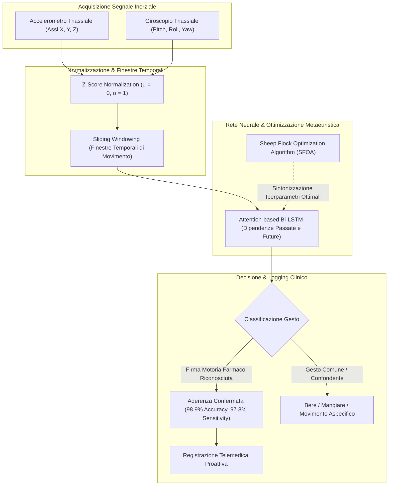

---
tags: [wearables, sensor-fusion, gesture-recognition, bi-lstm, sfoa, accelerometer, gyroscope, medication-adherence, passive-monitoring, remote-patient-monitoring]
source_papers: ["AI-PoweredReal-TimeAdherenceMonitoringforRemotePatientCareinTelemedicine.pdf"]
---

# Wearable Sensor Fusion and Gesture Recognition for Passive Adherence Monitoring

## Definizione Operativa
- L'utilizzo integrato di sensori inerziali indossabili (accelerometri e giroscopi triassiali inseriti in smartwatch commerciali o cerotti cutanei smart) combinati con reti neurali ricorrenti attentive (*Attention-based Bidirectional LSTM*) e algoritmi metaeuristici bio-ispirati (*Sheep Flock Optimization Algorithm* - SFOA) per il tracciamento passivo e non invasivo della specifica sequenza cinematica mano-bocca (*hand-to-mouth motor signature*) associata all'assunzione farmacologica (Joshua & Peterson, 2025; Rahman et al., 2024).
- **Utilità Clinica e Telemedica:** Elimina il carico comportamentale (*user burden*) per il paziente associato alla registrazione attiva di video o all'annotazione su diari, assicurando un monitoraggio continuo a lungo termine e discriminando accuratamente l'ingestione della pillola rispetto ad altre attività quotidiane con pattern motori simili (alimentazione, idratazione, igiene orale).

---

## Evidenze dalla Letteratura

### 1. Architettura della Pipeline Sensoriale e Preprocessing
- **Acquisizione Multiasse:** I sensori inerziali integrati in smartwatch o patch medicali acquisiscono vettori di accelerazione lineare triassiale (ACC) e velocità angolare (GYRO) a frequenze di campionamento calibrate.
- **Normalizzazione Z-Score:** I segnali grezzi sono caratterizzati da elevato rumore biologico e variabilità individuale. L'applicazione della *Z-score normalization* ($\mu = 0, \sigma = 1$) standardizza le serie temporali, rendendo l'algoritmo sensibile alla dinamica angolare intrinseca del gesto terapeutico indipendentemente dalla velocità o forza muscolare del paziente (Joshua & Peterson, 2025).

---

### 2. Architettura Neurale Attention-Bi-LSTM e Ottimizzazione SFOA
- **Bidirectional LSTM (Bi-LSTM):** A differenza delle RNN unidirezionali o delle LSTM tradizionali, la Bi-LSTM elabora la sequenza cinematica in avanti e all'indietro lungo l'asse temporale. Questo consente di contestualizzare l'intera traiettoria del gesto:
  1. *Fase iniziale di prensione*: Movimento della mano verso il blister/flacone;
  2. *Fase di elevazione e orientamento*: Traslazione verso il cavo orale con specifica rotazione dell'avambraccio;
  3. *Fase di rilascio e ritorno*: Inclinazione del capo e ritorno della mano in posizione di riposo.
- **Meccanismo di Attenzione (*Attention Mechanism*):** Assegna pesi dinamici ai sub-intervalli della finestra temporale, isolando i micro-movimenti critici della deglutizione e attenuando le oscillazioni accidentali.
- **Sheep Flock Optimization Algorithm (SFOA):** Per superare i problemi di convergenza in minimi locali durante l'addestramento, viene impiegato l'algoritmo bio-ispirato SFOA per la sintonizzazione automatica degli iperparametri (numero di unità nascoste, learning rate, dropout e dimensione del batch), consentendo di raggiungere un'accuratezza del **98.90%** e una sensibilità del **97.80%** (Rahman et al., 2024; Joshua & Peterson, 2025).

---

### 3. Benchmark Sperimentali e Confronto Prestazionale

| Modello / Algoritmo | Dispositivo Hardware | Popolazione / Target | Accuratezza | Sensibilità |
| :--- | :--- | :--- | :--- | :--- |
| **SFOA-Bi-LSTM** | Smartwatch (ACC + GYRO) | Riconoscimento Gesti Aderenza | **98.90%** | **97.80%** |
| **Movelet Algorithm** | Smartwatch Wearable | Coorte Pazienti Oncologici | **85.00%** | N/A |
| **Standard LSTM** | Smartband Inerziale | Attività Quotidiane Complesse | 89.20% | 88.50% |
| **Random Forest** | Sensori da Polso | Pazienti con Fibromialgia | 78.40% | 76.10% |

---

### 4. Vantaggi, Trade-off e Sfide Aperte

1. **Passività e Basso Carico Cognitivo:** Il monitoraggio passivo non richiede alcuna azione consapevole o interazione con lo smartphone al momento dell'assunzione, garantendo tassi di adozione costanti anche in pazienti anziani o con deficit cognitivi lievi.
2. **Resistenza ai Falsi Positivi:** La combinazione di segnali giroscopici e accelerometrici consente di distinguere efficacemente l'atto dell'ingestione farmacologica dal consumo di pasti o bevande, superando le criticità delle smart pill bottles.
3. **Efficienza Energetica e Calcolo on-Edge:** I flussi numerici a 6 gradi di libertà (ACC+GYRO) richiedono una banda e una potenza computazionale notevolmente inferiori rispetto ai flussi video, consentendo l'elaborazione diretta su dispositivi indossabili (*edge AI*).
4. **Sfide Aperte:** Necessità di adattamento per soggetti con disturbi del movimento (es. tremore da Parkinson o atassie) e compensazione per l'uso dell'orologio sul braccio dominante vs non dominante.

---

**Riferimenti Bibliografici:**
- Joshua, C., & Peterson, W. (2025). AI-Powered Real-Time Adherence Monitoring for Remote Patient Care in Telemedicine. *Research Article*, June 2025.
- Zisanur Rahman, Md., et al. (2024). A Smart Wearable Sensor-Based Model for Medication Adherence Using SFOA-Bi-LSTM. *Digital Health*, 10, 1-15.
- Haas, K., et al. (2019). Predicting Medication Adherence in Fibromyalgia Patients Using Random Forest. *Digital Health Journal*, 5(1), 1-12.

---

## Relazioni
- [[AI-PoweredReal-TimeAdherenceMonitoringforRemotePatientCareinTelemedicine]]
- [[video-observed-therapy-ai]]
- [[proactive-surveillance-alert-fatigue]]
- [[privacy-preserving-rpm-frameworks]]
- [[chronic-disease-monitoring-adherence]]
- [[software-as-a-medical-device-salute-mentale]]