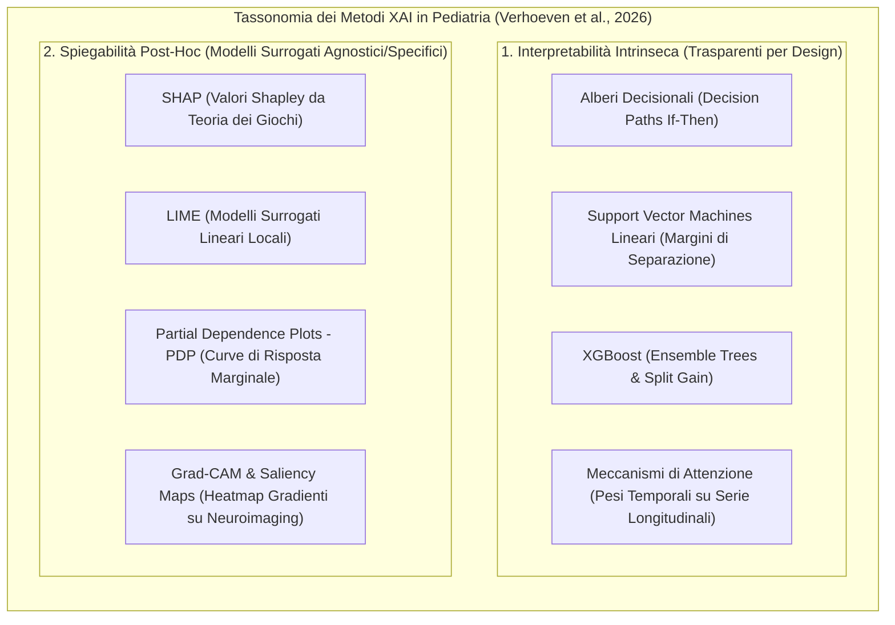
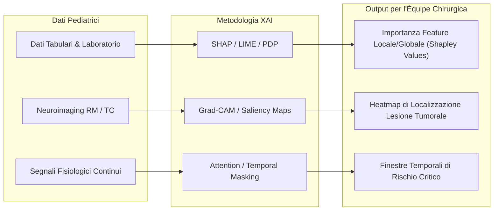

---
tags: [explainable-ai, xai, pediatric-surgery, interpretabilita-intrinseca, spiegabilita-post-hoc, shap, lime, grad-cam, xgboost, clinical-decision-support]
source_papers: ["a-2702-1843.pdf"]
---

# Explainable AI (XAI) in Pediatric Surgery and Medicine

## Definizione Operativa
- Insieme di metodologie, algoritmi e paradigmi di visualizzazione di **Intelligenza Artificiale Spiegabile (Explainable AI, XAI)** applicati alla medicina e alla chirurgia pediatrica, finalizzati a superare l'opacità dei modelli predittivi cosiddetti "black-box" (scatola nera) rendendo espliciti, tracciabili e clinicamente verificabili i fattori determinanti (*feature importance*), i confini decisionali e i pattern spaziotemporali sottostanti a ogni predizione algoritmica (Verhoeven et al., 2026).
- **Utilità Clinica e Chirurgica:** Permette a chirurghi, pediatri e team multidisciplinari di validare la plausibilità biologica delle raccomandazioni dell'IA, prevenire l'errore clinico e il sovraffidamento (*automation bias*), comunicare in modo trasparente e comprensibile le opzioni terapeutiche a genitori e pazienti (garantendo un consenso informato valido ed evitando l'*AI-paternalism*), e soddisfare i requisiti vincolanti dell'**EU AI Act** per i dispositivi medici ad alto rischio.

---

## Evidenze dalla Letteratura

### 1. Il Razionale Clinico dell'XAI nell'Età Evolutiva
- **Opacità dei Modelli e Rischio Clinico:** In chirurgia pediatrica, le decisioni terapeutiche possono avere impatti irreversibili sullo sviluppo e sulla crescita del bambino. Un modello predittivo accurato ma opaco impedisce al chirurgo di comprendere se la stima del rischio si basi su autentici biomarcatori fisiopatologici o su correlazioni spurie (Verhoeven et al., 2026).
- **Stato dell'Arte e Deficit di Validazione:** Revisioni sistematiche dimostrano che solo il **44% dei modelli di IA in chirurgia pediatrica incorpora tecniche di interpretabilità**, e solo il **6% risulta contemporaneamente interpretabile ed esternamente validato** (Elahmedi et al., 2024).
- **Calibrazione della Fiducia (*Appropriate Trust*):** L'XAI previene sia l'*automation bias* (accettazione acritica di predizioni errate) sia il rifiuto clinico o sottoutilizzo (*medical distrust*) di raccomandazioni algoritmiche accurate (Jorritsma et al., 2015; Verhoeven et al., 2026).

---

### 2. Metodologie di Interpretabilità Intrinseca

I modelli intrinsecamente interpretabili possiedono un'architettura matematica trasparente che consente di ispezionare direttamente la logica decisionale:

1. **Alberi Decisionali (*Decision Trees*):**
   - *Meccanismo:* Suddivisione gerarchica delle variabili cliniche secondo regole binarie sequenziali (es. soglie di leucociti, proteina C-reattiva o temperatura).
   - *Applicazione Pediatrica:* Modelli di screening per la diagnosi precoce di **sepsi pediatrica** e appendicite acuta.
   - *Punti di forza e limiti:* Massima intuitività per il clinico; tuttavia, soffrono di instabilità e rischio di overfitting su coorti pediatriche ridotte e non gestiscono relazioni non lineari complesse.
2. **Support Vector Machines (SVM) Lineari:**
   - *Meccanismo:* Identificazione dell'iperpiano ottimale che separa classi cliniche (es. complicanza vs non complicanza), con pesi direttamente interpretabili come coefficienti di importanza delle feature.
   - *Applicazione Pediatrica:* Stratificazione del rischio di complicanze post-operatorie e rigetto di trapianto d'organo (fegato, cuore).
   - *Punti di forza e limiti:* Ottima gestione di spazi ad alta dimensionalità (dati omici, biomarcatori sierici), ma limitato a confini di separazione lineari.
3. **XGBoost (Ensemble di Alberi Potenziati):**
   - *Meccanismo:* Combinazione di alberi decisionali iterativi tramite gradient boosting; quantifica l'importanza di ciascuna feature aggregando il guadagno informativo (*gain*) e la frequenza di splitting.
   - *Applicazione Pediatrica:* Predizione degli esiti riabilitativi dopo **chirurgia per deformità spinale pediatrica** (Shi et al., 2025), dove i parametri sagittali della colonna e i punteggi di auto-immagine (*self-image*) del paziente sono emersi come i predittori cardine.
4. **Meccanismi di Attenzione (*Attention Mechanisms*):**
   - *Meccanismo:* In modelli per serie temporali (Transformer, RNN), assegnano pesi dinamici ai singoli intervalli temporali o segnali fisiologici.
   - *Applicazione Pediatrica:* Monitoraggio continuo dei parametri vitali per la predizione tempestiva di **enterocolite necrotizzante (NEC)** nei neonati pretermine (Verhoeven et al., 2024).

---

### 3. Metodologie di Spiegabilità Post-Hoc

Applicate a posteriori su architetture complesse (es. reti neurali profonde e CNN):

1. **SHAP (Shapley Additive Explanations):**
   - *Meccanismo:* Fondato sulla teoria dei giochi cooperativi, assegna a ogni feature un valore Shapley che quantifica il suo contributo marginale rispetto alla predizione media di base.
   - *Applicazione Pediatrica:* Identificazione dei fattori determinanti per il rischio di **malnutrizione post-operatoria in bambini con cardiopatie congenite** (Shi et al., 2022).
2. **LIME (Local Interpretable Model-agnostic Explanations):**
   - *Meccanismo:* Approssima localmente la superficie decisionale del modello black-box costruendo un modello surrogato interpretabile (es. regressione lineare pesata) nell'intorno del singolo paziente.
   - *Applicazione Pediatrica:* Spiegazione di predizioni individuali nello screening del disturbo dello spettro autistico infantile (Jeon et al., 2024).
3. **Partial Dependence Plots (PDP):**
   - *Meccanismo:* Traccia la variazione marginale della probabilità di esito al variare di una specifica feature clinica, mantenendo costanti tutte le altre. Consente di individuare effetti soglia fisiologici.
4. **Saliency Maps e Grad-CAM (Gradient-weighted Class Activation Mapping):**
   - *Meccanismo:* Utilizza i gradienti che fluiscono nell'ultimo strato convoluzionale per generare mappe di attivazione visiva (heatmap cromatiche) sulle regioni anatomiche di interesse.
   - *Applicazione Pediatrica:* Classificazione e localizzazione di **tumori cerebrali pediatrici su risonanza magnetica (MR)** (Tampu et al., 2024), permettendo a neuroradiologi e chirurghi di confermare che il modello non si basi su artefatti radiologici periferici.

---

### 4. Limiti Strutturali e Necessità di Benchmark Dedicati
- **Fallacia di Causalità (Correlazione $\neq$ Causalità):** Le tecniche XAI evidenziano correlazioni tra feature e target, ma non dimostrano un legame causale. L'applicazione incauta di interventi basati su correlazioni non causali può causare inefficacia o danni iatrogeni (Verhoeven et al., 2026).
- **Confirmation Bias Clinico:** I medici tendono a sovrastimare la bontà delle spiegazioni che confermano le loro convinzioni a priori (*confirmation bias*, Ghassemi et al., 2021).
- **Spiegazioni Multilivello (*Multi-Audience*):** La spiegazione deve essere declinata su tre livelli di complessità comunicativa: (1) dettaglio tecnico-clinico per il chirurgo; (2) sintesi comprensibile per i genitori ai fini del consenso informato; (3) comunicazione rassicurante e adatta all'età per il minore (*child-friendly*).
- **Inadeguatezza dei Benchmark per Adulti:** Benchmark come **BenchXAI** e **XAIB** mancano di dataset specifici per le traiettorie di sviluppo infantile e richiedono l'integrazione di metriche pediatriche dedicate (Metsch & Hauschild, 2025; Goncharenko et al., 2025).

---

## Riferimenti Bibliografici
- Verhoeven, R., Bouisaghouane, W., & Hulscher, J. B. F. (2026). Explainable AI: Ethical Frameworks, Bias, and the Necessity for Benchmarks. *European Journal of Pediatric Surgery*, 36(1), 168–173. https://doi.org/10.1055/a-2702-1843
- Elahmedi, M., Sawhney, R., Guadagno, E., Botelho, F., & Poenaru, D. (2024). The state of artificial intelligence in pediatric surgery: a systematic review. *Journal of Pediatric Surgery*, 59(5), 774–782.
- Ghassemi, M., Oakden-Rayner, L., & Beam, A. L. (2021). The false hope of current approaches to explainable artificial intelligence in health care. *The Lancet Digital Health*, 3(11), e745–e750.
- Goncharenko, I., Zahariev, I., Gorbunov, S., et al. (2025). Open and extensible benchmark for explainable artificial intelligence methods. *Algorithms*, 18(2), 85.
- Jeon, I., Kim, M., So, D., et al. (2024). Reliable autism spectrum disorder diagnosis for pediatrics using machine learning and explainable AI. *Diagnostics*, 14(22), 2504.
- Metsch, J. M., & Hauschild, A. C. (2025). BenchXAI: comprehensive benchmarking of post-hoc explainable AI methods on multi-modal biomedical data. *Computers in Biology and Medicine*, 191, 110124.
- Shi, H., Yang, D., Tang, K., et al. (2022). Explainable machine learning model for predicting the occurrence of postoperative malnutrition in children with congenital heart disease. *Clinical Nutrition*, 41(1), 202–210.
- Shi, W., Giuste, F. O., Zhu, Y., et al. (2025). Predicting pediatric patient rehabilitation outcomes after spinal deformity surgery with artificial intelligence. *Communications Medicine*, 5(1), 1.
- Tampu, I. E., Bianchessi, T., Blystad, I., et al. (2024). Pediatric brain tumor classification using deep learning on MR images with age fusion. *Neuro-Oncology Advances*, 7(1), vdae205.

---

## Relazioni
- Vedi anche: [[a-2702-1843]], [[pediatric-ai-bias-and-vulnerabilities]], [[accept-ai-and-pediatric-ethical-frameworks]], [[pediatric-xai-benchmarking]], [[explainable-mental-health-diagnosis]], [[reflective-interpretability]], [[audit-bias-llm-clinici]], [[software-as-a-medical-device-salute-mentale]], [[three-layer-governance-framework]]